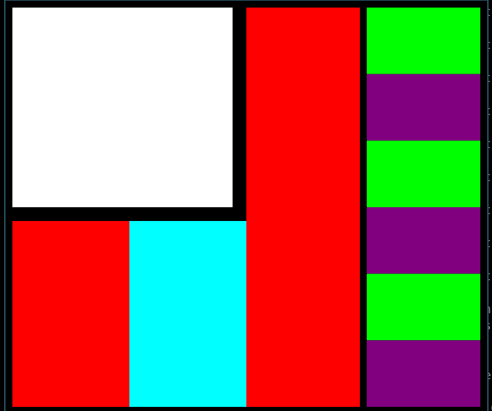

# ScenicLayout

This is an experimental library for render layouts using scenic.

## Sample

```elixir
defmodule ScenicLayoutTest.Scene.Test do
  use ScenicLayout

  require Logger

  view_port margin: 10 do
    linear_layout orientation: :horizontal do
      linear_layout height: :fill_parent, orientation: :vertical do
        box(color: :white, margin_right: 20, margin_bottom: 20)

        linear_layout height: :fill_parent, orientation: :horizontal do
          box(color: :red, height: :fill_parent, width: :fill_parent)
          box(color: :cyan, height: :fill_parent, width: :fill_parent)
        end
      end

      linear_layout height: :fill_parent, orientation: :horizontal do
        box(color: :red, padding_right: 10)

        linear_layout height: :fill_parent, orientation: :vertical do
          box(color: :lime, height: :fill_parent, width: :fill_parent)
          box(color: :purple, height: :fill_parent, width: :fill_parent)
          box(color: :lime, height: :fill_parent, width: :fill_parent)
          box(color: :purple, height: :fill_parent, width: :fill_parent)
          box(color: :lime, height: :fill_parent, width: :fill_parent)
          box(color: :purple, height: :fill_parent, width: :fill_parent)
        end
      end
    end
  end

  def handle_input(event, context, state) do
    Logger.info("Received event: #{inspect(event)} from #{inspect(context.id)}")
    {:noreply, state}
  end
end
```

<p align="center">
  <br>
  <br>
  <br>
    Rendered scene
  <br>
</p>

## Installation

If [available in Hex](https://hex.pm/docs/publish), the package can be installed
by adding `scenic_layout` to your list of dependencies in `mix.exs`:

```elixir
def deps do
  [
    {:scenic_layout, "~> 0.1.0"}
  ]
end
```
